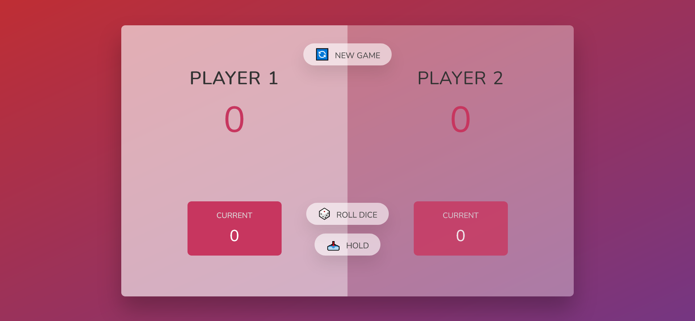
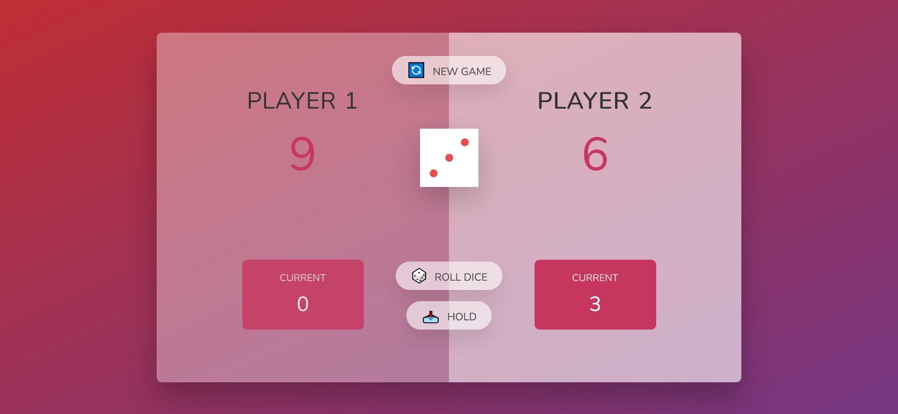

# Welcome! 👋
# This DiceGame project is built in order to practice DOM manipulation while taking a JavaScript course with Jonas Schmedtmann [on Udmy]).
# Note that when the dice is 1 , the player misses his turn. 
Hope you enjoy it.

# Initial Preview

# While Playing Preview

# Winner State Preview

# Built with

    JavaScript 
    DOM manipulation
    Semantic HTML5 markup
    CSS3
    

